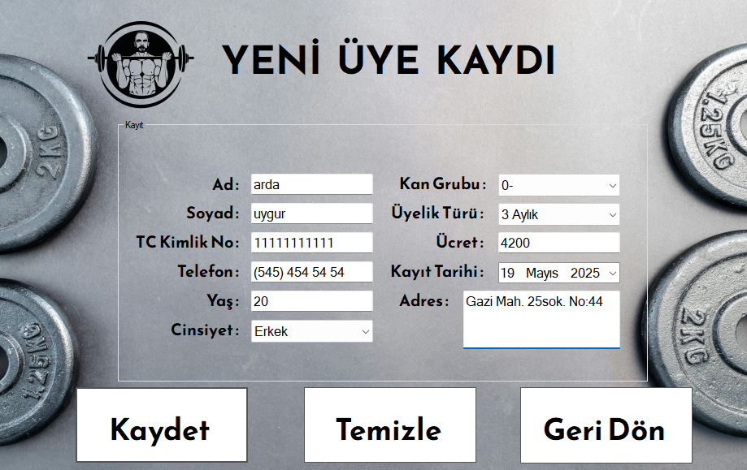
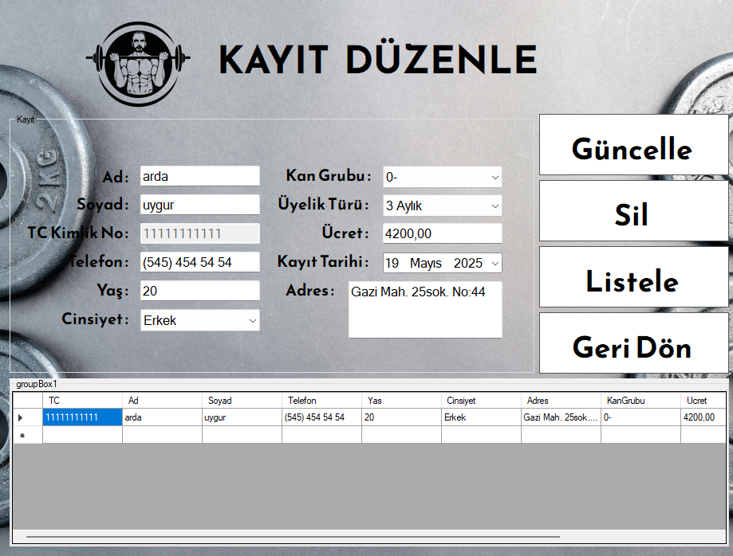

# 🏋️‍♂️ C# Spor Salonu Üye Yönetim Sistemi

## 📌 Proje Özeti
Spor salonu personelinin yeni üye kaydı yapabilmesi, mevcut üyeleri listeleyebilmesi ve üyelik bilgilerini güncelleyip silebilmesi amacıyla geliştirilmiş masaüstü otomasyonudur.

## 🚀 Kullanılan Teknolojiler
* **Programlama Dili & Altyapı:** C# (.NET Framework)
* **Veri Tabanı:** Microsoft SQL Server
* **Veri Erişim Mimarisi:** ADO.NET (`SqlConnection`, `SqlCommand`, `SqlDataReader`)
* **Arayüz:** Windows Forms

## ⚙️ Teknik Detaylar ve Geliştirmeler
* **Veri Tabanı İşlemleri:** ADO.NET mimarisi kullanılarak veri tabanı üzerinde Ekleme, Silme ve Güncelleme işlemleri entegre edilmiştir.
* **Dinamik Veri Aktarımı:** Veri tabanından çekilen liste üzerindeki herhangi bir satıra çift tıklandığında (`CellDoubleClick`), o üyeye ait tüm veriler anında form elemanlarına doldurularak hızlı düzenleme imkanı sağlanmıştır.
* **Veri Güvenliği:** SQL Injection risklerine karşı veri tabanı sorgularında parametrik yapı (`AddWithValue`) kullanılmıştır.
* **Arayüz (UI) Detayları:** Formlardaki Label ve PictureBox elementlerinin arka planları `Parent` metoduyla transparan hale getirilmiş, `KeyPreview` özelliği ile kullanıcıların ESC tuşuyla formlardan hızlıca çıkabilmesi sağlanmıştır.

## 📸 Ekran Görüntüleri

### Yeni Üye Kayıt Ekranı

### Kayıt Düzenleme ve Listeleme

